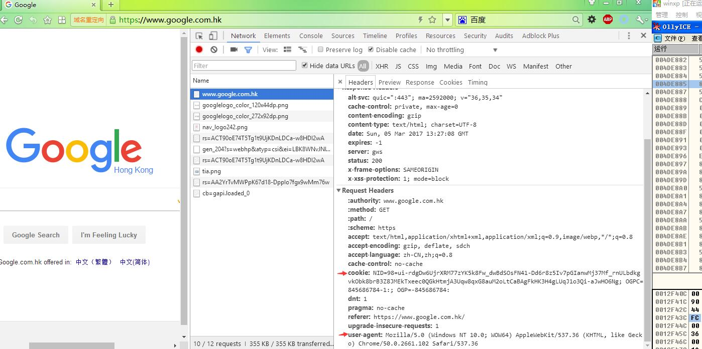

# EasyLogin.py

[](https://travis-ci.org/zjuchenyuan/EasyLogin) [](https://codecov.io/gh/zjuchenyuan/EasyLogin)

One file package `EasyLogin.py`, for writing spiders more easily

Just forget UserAgent, Cookies, and Cache... Let EasyLogin take care of all these things, so you can focus on your core code.

[中文版文档](README_ZH.md)

## Requirements, better using Python3

    pip3 install -U requests[socks] bs4 -i https://pypi.doubanio.com/simple/ --trusted-host pypi.doubanio.com

## Quickstart

Using EasyLogin is very EASY!

First, import it and create an object:

    from EasyLogin import EasyLogin
    a = EasyLogin()
    
Then, make a get request or post request:

    html = a.get("http://ip.cn") # you can look up the source code of this "http://ip.cn"

What I need are in the `<code>` tag, extract these `<code>` tag:

Tip: use `a.b` as a BeautifulSoup object

    code_tags = a.b.find_all("code",attrs={}) #find_all is a method of BeautifulSoup object
    myIP = code_tags[0].text
    mylocation = code_tags[1].text

> To simplify this, I created a `f` method, return text of all tags that match tag name and attrs: 

>    myIP,mylocation = a.f("code",attrs={})

Finally, just print them~

    print(myIP) #this will print your own IP
    print(mylocation)

Moreover, I also need img, css, js and text:

    print(a.img())
    print(a.css())
    print(a.js())
    print(";".join(a.text()))

## Documentation

### Before we continue...

Do you know about HTTP protocol? If not, look at [this](https://en.wikipedia.org/wiki/Hypertext_Transfer_Protocol).

Here are some keywords for writing a spider: Cookie, User-Agent, Referer, Proxy

Here is a screenshot of using Chrome Developer Tools to inspect the http(s) request, in this picture, you can see some headers are sent to the server. Among these headers, `Cookie` and `User-Agent`(case-insensitive) are the most important for us writing a spider, by the way, sometimes the `Referer` is also essential.




### Object Initialization

```
def __init__(self, cookie=None, cookiestring=None, cookiefile=None, proxy=None, session=None)
```

Example:

```
from EasyLogin import EasyLogin
a=EasyLogin(cookie={"a":"b","c":"d"},cookiestring="e=f;g=h",cookiefile="my.status",proxy="socks5://127.0.0.1:1080")
```

When you create the object, you can specify cookie by using `cookie` or `cookiestring`, or even restore cookie status from a file `cookiefile`. And for debug or bypass GFW, you can set the proxy.

_cookie_ : a dict, key-value

_cookiestring_: You can copy this string from Chrome

_cookiefile_: this file is created by `save=True`, which we will talk about later. If this file does not exist, nothing will happen.

## Make a request: get/post

Here are a lot of useful methods in EasyLogin, but the essential ones must be `get` and `post`

```
def get(self, url, result=True, save=False, headers=None, o=False, cache=None, r=False, cookiestring=None,failstring=None)

def post(self, url, data, result=True, save=False, headers=None,cache=None)
```

__result__: use the BeautifulSoup to parse the html, default is True (if you care about time performance, please use `result=False` and use `re` module or whatever you want to extract information needed)

__save__: used in login request, if `save=True`, write the cookie to a file, filename is given by `cookiefile` during the object initialization(default is cookie.pickle)

__headers__: dict, like {"csrf-token":"xxxxxx"}, added to request headers; default value contains `Content-Type: application/x-www-form-urlencoded; charset=UTF-8`, if you would like specify a new `Content-Type`, please notify case-sensitive `Content-Type`

__cache__: filename to write cache, if already exists, use cache rather than really get; using cache=True to use md5(url) as cache file name

__failestring__: if failstring occurs in text, raise an exception

for each request, the url is the basic one, for example, if a website has taken no anti-crawler actions, the url itself is enough.

```
>>> page=a.get("http://ip.cn")
>>> print(len(page))
3133
```

### Need the request object? o=True

this will get the source code of "ip.cn", we choose this as a demo, because it contains a useful information: your ip and your location.

the technique below the EasyLogin is `requests`, and this function is actually calling requests.get (more precisely, requests.Session().get). So you may wonder how to get the request object like you get by doing `x=requests.get("http://ip.cn")`, the method is as below:

```
>>> from EasyLogin import EasyLogin
>>> a=EasyLogin()
>>> x=a.get("http://ip.cn",o=True)
>>> print(x.headers)
{'Transfer-Encoding': 'chunked', 'Connection': 'keep-alive', 'Content-Type': 'text/html; charset=UTF-8', 'Content-Encoding': 'gzip', 'Server': 'nginx/1.10.0 (Ubuntu)', 'Date': 'Sun, 05 Mar 2017 14:05:57 GMT'}
>>> x=a.get("http://httpbin.org/redirect-to?url=http%3A%2F%2Fexample.com%2F", o=True)
>>> x.headers["Location"]
'http://example.com/'
```

### use cache to speed up! cache=True

Imaging you are crawling a website, you need to modify the information extracting rule many times, but you don't need to crawl the website that much, once you have find out the url needed to crawl, just request one time and reuse the cache afterwards. I strongly recommend using cache to save your time!

```
>>> for i in range(5):
...     a.get("http://httpbin.org/stream/{i}".format(i=i), cache=True)
...
>>> import os;os.listdir(".")
['189091a11fd93218d3f95b4365576163', '3647fa4f6df52ce929158bc88cffbc59', '4c1e81a0b25286d8582f650e3b71f3aa', '896fa92d285edffb17509f10218f8b6e', 'b9a9e3036d06219bca93b22889f31fec']
```

if you want to control the cache filename, just set the filename to cache, like `cache="%d.html"%i`, otherwise if you don't care about the filename, just use `cache=True`, EasyLogin will use the md5(url) as the filename in get request, and use the md5(url+request_data) in post request.

### html is a mess? you can specify **fixfunction** to help you

This parameter only applies to `get` now.

Consider if the page html is not standard (like "`<th>...</td>`"), you can specify a function to **fixfunction** parameter.

This function will be called after html **bytes** data fetched, before BeautifulSoup is called; so you can do simple replace beforehand to avoid getting a messed soup.

This function should receive one parameter (type: **bytes**), and return bytes (then passed to BeautifulSoup), so lambda function may be a good choice

Example:

```
# replace all th tag to td
a.get(..., fixfunction=lambda html: html.replace(b"<th",b"<td").replace(b"</th",b"</td"))
```

Otherwise, you can just do it yourself:

```
from bs4 import BeautifulSoup
page = a.get(..., result=False) # specify result=False to avoid calling BeautifulSoup
page = page.replace("<br>", "\n").replace("<BR>", "\n") # this is rather useful, so if you use EasyLogin without result=False, this is done automatically
page = page.replace("<th","<td").replace("</th","</td") # your replace function here; not bytes, but str
a.b = BeautifulSoup(page, "html.parser")
```

Compare to using **fixfunction**, this way seems rather complicate and unnecessary, ha?

## Get the data out! use a.b as a `BeautifulSoup` object

feeling bored about write `soup=BeautifulSoup(page,"html.parser")`? By using EasyLogin, this step is **automated** unless you specify `result=False`, the soup object will be set to `self.b`, so if you're using a=EasyLogin() then you should use **a.b**

Not familiar with BeautifulSoup? Here is the [documentation](https://www.crummy.com/software/BeautifulSoup/bs4/doc/)

```
>>> a.get("http://ip.cn")
>>> print(a.b.find("code"))
<code>183.157.162.52</code>
>>> print(a.b.find_all("a",attrs={"target":"_blank"}))
[<a href="https://www.yunduo.io" target="_blank">云朵</a>, <a href="http://www.miitbeian.gov.cn/" target="_blank">沪ICP备15005128号-3</a>]
```

For more convenience, I also prepared these methods for you to play with:

### getlist

```
def getlist(self, searchString, elementName="a", searchTarget="href", returnType=None):
    """
    get all urls which contain searchString
    :param searchString: keywords to search
    :param elementName: Tag name
    :param searchTarget: "href", "src", etc...
    :param returnType: "element" to return the Tag object, None to return element[searchTarget]
    :return: list
    """
```

Examples:

```
#get all picture:
    a.getlist("","img","src")
#get all picture which src contains png:
    a.getlist("png","img","src")
#get all css and js:
    a.getlist("css","link","href")
    a.getlist("js","script","src")
#get all `a` tag which contains `http`:
    a.getlist("http","a","href",returnType="element")
```

#### img/css/js

just as you see, return all img/css/js urls

because requests.get("//example.com/something.png") is not legal, so for avoid this problem in downloading the pictures, these functions will delete the first two characters if they're "//". How considerate I am!

### VIEWSTATE

return the VIEWSTATE string after quoted, if you're going to use it for `post_dict`, remember to unquote

```
>>> x=a.get("http://jwbinfosys.zju.edu.cn/default2.aspx")
>>> print(a.VIEWSTATE())
dDwxNTc0MzA5MTU4Ozs%2BRGE82%2BDpWCQpVjFtEpHZ1UJYg8w%3D
```

### find

I don't recommend using the method...

TODO: develop this function to be stable and reliable

### d: delete tags not needed

Feeling messed up with useless tags? Here method `d` can delete them for you!

```
def d(self,tag,attrs,all=False)
```

if `all=False`, it will only delete the first one matched.

Example:

```
a.d("span",{"class":"junk"},all=True)
```

### text

Get all text in HTML, skip script and comment, return a list of strings

```
>>> x=a.get("http://www.stanford.edu")
>>> a.text()
['html', 'Stanford University', 'Skip to content', 'Menu', 'Search form', 'Web', 'People', 'Search term', 'About Stanford', 'Admission', 'Academics', 'Research', 'Campus Life', 'Information for...', 'Students', 'Faculty / Staff', 'Parents', 'Alumni', 'Story 1', 'Story 2', 'Story 3', 'Story 4', 'Story 5', 'Building a brain', 'Reverse engineering our most mysterious organ takes teams of Stanford neuroscientists and engineers working together.', 'A warm welcome', 'Family Weekend 2017 offers relatives an opportunity to sample student life and spend time with their loved ones.', 'Entrepreneurship at Stanford', 'By incubating ideas and new technologies and educating leaders, Stanford plays a key role in entrepreneurship worldwide.', 'Partners in discovery', 'Working together, researchers at SLAC and Stanford expand our knowledge of materials, molecules and the universe.', 'A meaningful life', 'At Stanford, Supreme Court Justice Ruth Bader Ginsburg talks about her role models, her career and the importance of serving the community.', 'Previous Story', 'Next Story', 'Top Stories', 'Illusion of choice', 'Vouchers do not improve student achievement, Stanford researcher finds.', 'New dean', 'Computer scientist Jennifer Widom named dean of Stanford School of Engineering.', 'Mind over matter', "Stanford experts urge healthcare professionals to harness power of people's mindsets.", 'More headlines', 'Stanford affirms commitment to military veterans with expanded benefits, programs', 'Can you buy a better self-image?', 'Immigration resources and travel guidance for the Stanford community', 'More News', 'Latest tweet', '2 min.', 'ago', '@Stanford', '.', '@StanfordEd', 'faculty explore ways to help students take on the challenges of the kindergarten classroom.', 'stanford.io/2mjZaRs', 'At Stanford', 'Anderson Collection', "One of the world's most outstanding collections of modern and contemporary American art.", 'More sites', 'Events', 'MAR', '6', 'Juan Felipe Herrera Reading, part of the Lane Lecture Series', '8 p.m.', 'MAR', '7', 'The Fifth Annual Stephen H Schneider Memorial Lecture with John Holdren', '6:30 p.m.', 'MAR', '8', 'Honoring Lives, Remembering Losses: An Interfaith Grief Memorial', '12:15 p.m.', 'Event Calendar', 'Athletics', 'Akash Modi to represent U.S.', 'The senior gymnast will take a weekend off from the collegiate circuit to compete in the American Cup.', 'GoStanford.com', 'Schools', 'Business', 'Earth, Energy & Environmental Sciences', 'Education', 'Engineering', 'Humanities & Sciences', 'Law', 'Medicine', 'Departments', 'Departments A - Z', 'Interdisciplinary Programs', 'Research', 'Research Centers A - Z', 'Interdisciplinary Research', 'Libraries', 'Health care', 'Stanford Health Care', "Stanford Children's Health", 'Online Learning', 'Stanford Online', 'About Stanford', 'Facts', 'History', 'Accreditation', 'Admission', 'Undergraduate', 'Graduate', 'Financial Aid', 'Resources', 'A - Z Index', 'Campus Map', 'Directory', 'Stanford Profiles', 'Apply', 'Visit Campus', 'Make a Gift', 'Find a Job', 'Contact Us', 'SU Home', 'Maps & Directions', 'Search Stanford', 'Terms of Use', 'Emergency Info', '©', 'Stanford University', '.', 'Stanford', ',', 'California', '94305', '.', 'Copyright Complaints', 'Trademark Notice']
```
----

# Examples

You can take a look at my [examples](examples/)