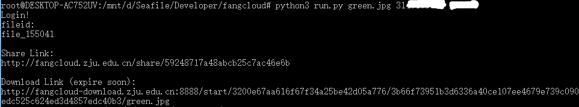

## 浙大云盘API

使用EasyLogin完成“浙大云盘”登录、上传、分享与下载直连获取一条龙

### 使用方法

这是EasyLogin的使用示例，请先访问https://github.com/zjuchenyuan/EasyLogin

下载好EasyLogin.py，并完成依赖安装

    python3 run.py 待上传的文件名 学号 统一通行证密码



### 说明

如果你之前从来没有访问过浙大云盘，第一次执行可能会失败，再运行一次就好了

本程序会自动保存、载入登录状态到fangcloud.status（使用EasyLogin提供的**save**与**load**函数）

所以在cookie没有失效时，不会发起登录请求

#### 函数说明

```
login(xh,password) #使用统一通行证的用户名密码登录
islogin() #是否已经登录,如果已经登录返回token，否则False
upload(token,filename,data) #上传文件，返回fileid
share(token,fileid) #分享文件，返回分享地址file_unique_name
download(file_uniqe_name) #从文件分享地址得到直接下载链接URL，本函数不要求登录
```