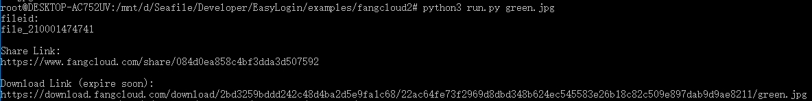

## 亿方云API

使用EasyLogin完成“亿方云”登录、上传、分享、下载直链获取

### 使用方法

这是EasyLogin的使用示例，请先访问https://github.com/zjuchenyuan/EasyLogin

下载好EasyLogin.py，并完成依赖安装

    python3 run.py 待上传的文件名 亿方云用户名 亿方云密码



### 说明

请先注册亿方云 https://www.fangcloud.com/auth/register ，体验版20G存储

本程序会自动保存、载入登录状态到fangcloud.status（使用EasyLogin提供的**save**与**load**函数）

所以在cookie没有失效时，不会发起登录请求。如图所示，此时可以不提供用户名密码参数

#### 函数说明

```
login(username,password) #用户名密码登录亿方云
islogin() #是否已经登录,如果已经登录返回token，否则False
upload(token,filename,data) #上传文件，返回fileid
share(token,fileid) #分享文件，返回分享地址file_unique_name
download(file_uniqe_name) #从文件分享地址得到直接下载链接URL，本函数不要求登录，也不会使用登录状态
```