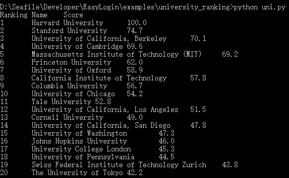

# University Ranking

Target: [http://www.shanghairanking.com/ARWU2016.html](http://www.shanghairanking.com/ARWU2016.html)

I need Ranking, University Name, and the total Score

## Screenshot



## Explanation

in this example, these method are used:

```
get: cache=True
d: delete some tags we don't need
text: get the text from a soup
```

detailed documentation is available [here](https://github.com/zjuchenyuan/EasyLogin)