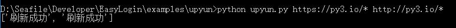

# 又拍云非官方API

本文件提供又拍云网页控制台的部分功能，以弥补现有API的不足

由于需要明文存储账号密码，不建议在生产环境使用，所以仅仅实现现有又拍云官方API没有提供的功能

目前功能包含：**规则刷新**

## config.py

需要写入网页控制台的登录需要的用户名和密码，请一定保密这个config.py

config.py的格式：

```
USERNAME="你的用户名"
PASSWORD="你的密码"
```

## 用法

写入好config.py后，运行`python3 upyun.py http://py3.io/*`即可刷新py3.io的缓存

支持同时刷新多个域名，只需要在命令行参数给出即可

