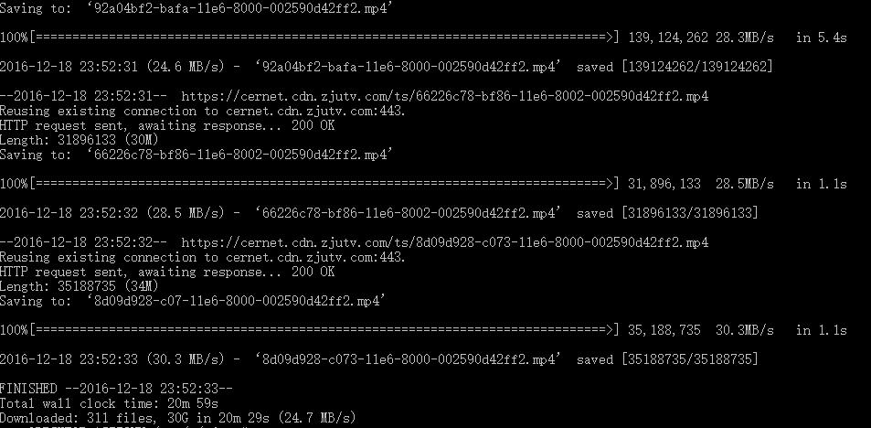
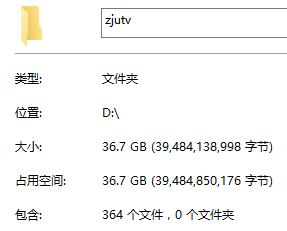
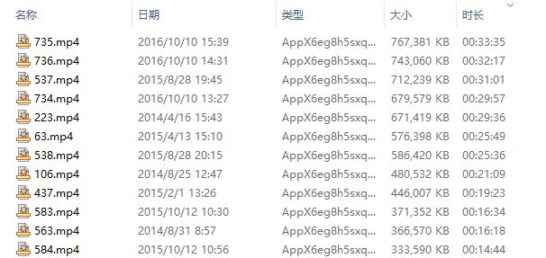

#浙江大学广播电视网视频下载

## 数据来源

如：2013普通话大赛（挺有意思的，快戳↓）

https://www.zdgd.zju.edu.cn/index.php?s=/home/player/index/id/7.html

## 这次我们要数据库

创建数据库、建表：
```sql
CREATE DATABASE zjutv DEFAULT CHARACTER SET utf8 COLLATE utf8_general_ci;
CREATE TABLE `data` (
  `id` int(11) NOT NULL,
  `name` varchar(255) CHARACTER SET utf8 DEFAULT NULL,
  `description` longtext CHARACTER SET utf8,
  `mp4` varchar(555) CHARACTER SET utf8 DEFAULT NULL,
  `share` varchar(255) CHARACTER SET utf8 DEFAULT NULL,
  PRIMARY KEY (`id`)
) ENGINE=InnoDB DEFAULT CHARSET=utf8;
```

## 代码说明 run.py

发现最新视频id为750，于是从1~751进行循环，存入数据库中: id(来自URL)，视频标题，视频简介(带有\n)，mp4下载链接

实际运行发现某些id并没有对应视频，或者视频不存在，使用了try-except简单跳过了

## 有了数据库多方便

    SELECT mp4 FROM `data` where mp4 like 'http%' and mp4 like '%cernet%';

执行上句sql提取出所有有效的下载链接，用wget进行下载：

    wget -i list.txt  --referer="https://www.zdgd.zju.edu.cn/index.php?s=/home/player/index/id/550.html" -c

这里有知识点~怎么用wget之**设置Referer绕开防盗链**和**列表批量下载**与**断点续传**

然后我们对文件改个名字：

    SELECT "move",SUBSTRING_INDEX(mp4, '/', -1),id,".mp4" FROM `data` where mp4 like 'http%' and mp4 like '%cernet%';
    
将执行结果复制到bat中，简单修改一下\t就能执行咯

## 最后来几张截图

第一次感受到寝室的千兆网速：



不过36.7G嘛（其实是很多视频域名不对，下载不了）：



按照视频时长排个序看看（最长的是开学典礼）：

